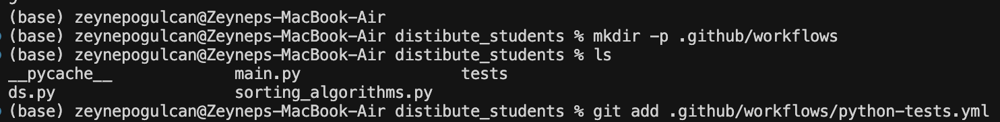
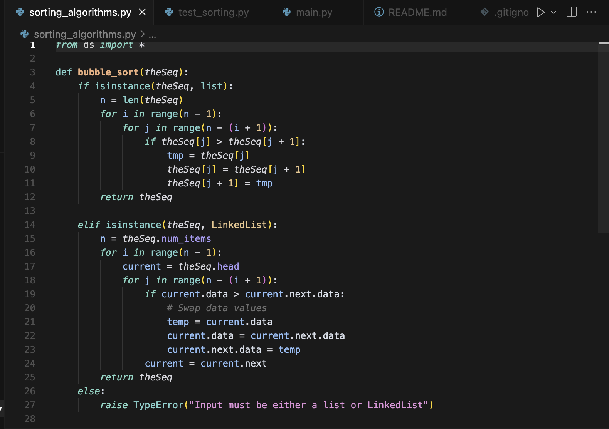
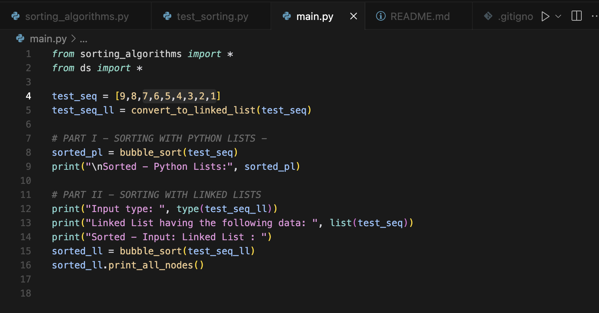
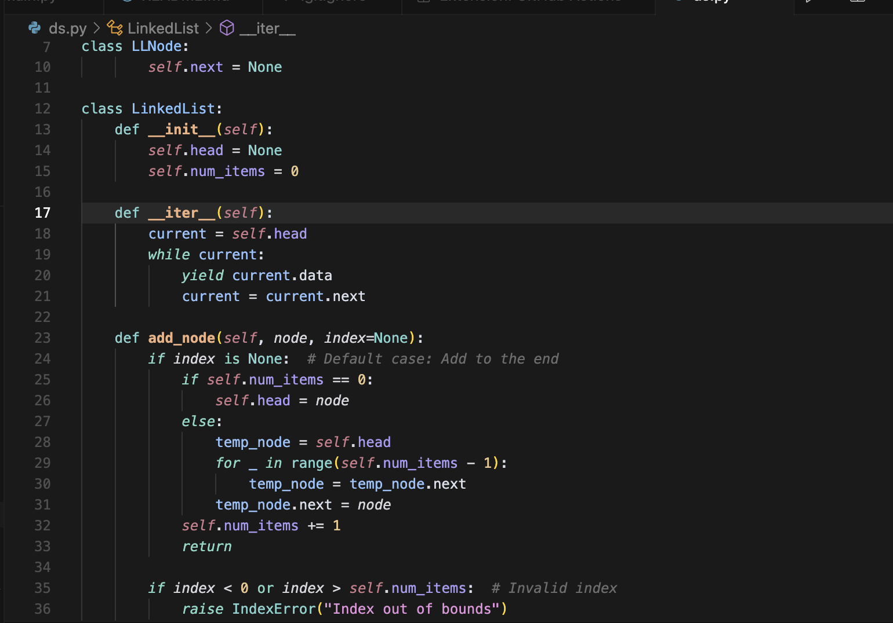
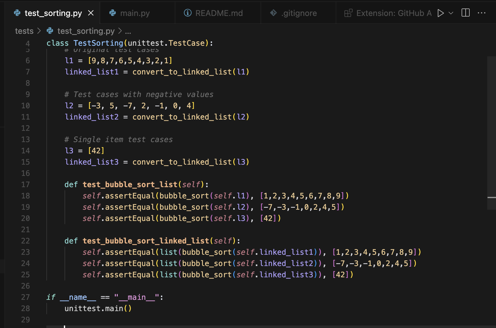
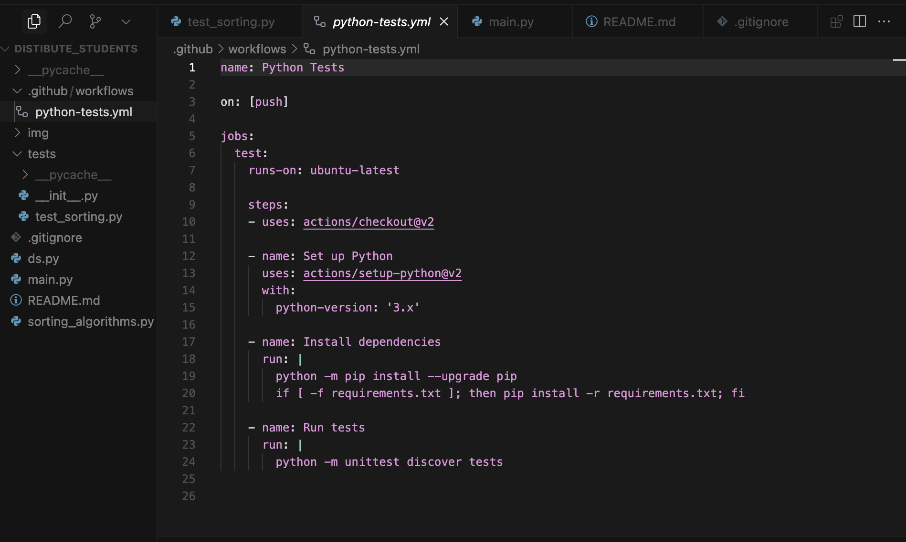
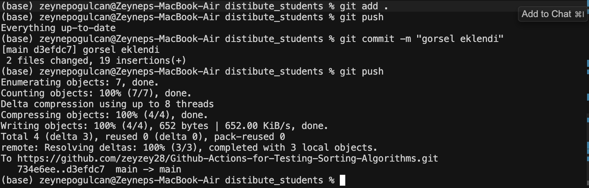

# Sorting Algorithms with GitHub Actions

This project implements bubble sort algorithm for both Python lists and linked lists with automated testing using GitHub Actions.

## Project Screenshots
### 1. Creating Workflow and Push to Github


### 2. Sorting Algorithms


### 3. Removed Comment Lines


### 4. Iter Class is Edited


### 5. Created Negative Values


### 6. Python Tests YML File Created



### 7. Added Images to ReadMe File


## Features
- Bubble sort implementation for Python lists
- Bubble sort implementation for linked lists
- Comprehensive test suite including:
  - Regular number sequences
  - Negative numbers
  - Single item lists
- Automated testing with GitHub Actions

## Error vs Failure Example
In software testing, there's an important distinction between errors and failures:

- **Error**: An error is a mistake in the code that may or may not lead to a failure. For example:
  ```python
  def divide(a, b):
      return a/b  # Error: No handling of division by zero
  ```

- **Failure**: A failure is when the program produces incorrect results or crashes. For example:
  ```python
  result = divide(10, 0)  # Failure: Program crashes due to division by zero
  ```

In our sorting implementation, an error would be not checking for None values in the linked list, while a failure would be the program crashing when given a None input.

## Usage of __iter__ Function
The `__iter__` function is implemented in our LinkedList class to make it iterable:

```python
def __iter__(self):
    current = self.head
    while current:
        yield current.data
        current = current.next
```

This implementation allows us to:
1. Convert LinkedList to Python list using `list()`
2. Use LinkedList in for loops
3. Make our LinkedList compatible with Python's iteration protocols

## AI Usage Statement
In developing this project, I used AI (specifically GitHub Copilot) in the following ways:
1. For writing test cases with different scenarios
2. For implementing the GitHub Actions workflow
3. For documentation and README generation

However, the core algorithm implementation and data structure design were done without AI assistance to ensure proper understanding of the concepts.